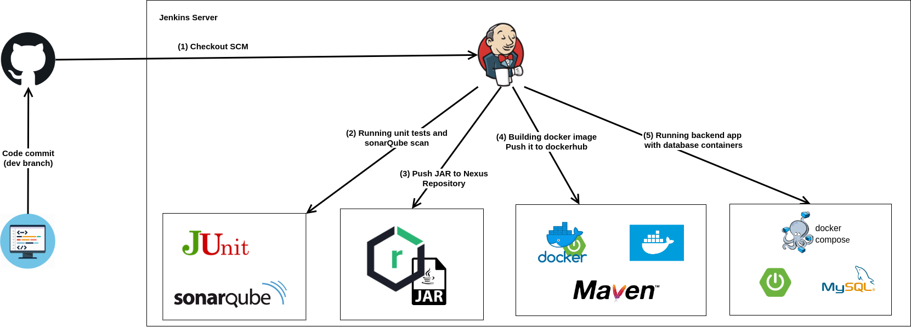

# Spring Devops project
## Description of the project

This project is created to test the process of a **CI/CD pipeline** using **Jenkins**.

We have a simple CRUD application, but our main goal would be to follow the process of the CI/CD pipeline and how to implement it.

The process of our pipeline will follow these steps :
* Running the unit tests and scanning the code using the sonarQube
* Building an artifact (JAR in our case) and pushing it to a Nexus repository
* Building the docker image for our application and pushing it to dockerhub
* Deploying the application in a deployment server

<p align="center">
  
</p>


In this step, I configured a sonar-server in order to run sonarQube container with MySQL containers for the database.
I create the required volumes to save the sonarQube data, logs and extensions.


This step is triggered by the jenkins pipeline using ssh agent that connects to sonar-server and runs the bash script responsible for
* running pulling the source code in the master branch
* starting a test database using docker compose
* resolving the dependencies and running the unit tests
* running sonar scanner command that anayses the code and takes the unit testing scan results thanks to jacoco plugin.


### Pushing JAR to Nexus repository


This step is quite simple, all that need to be done is:
* running nexus in a server
* adding the nexus plugin and configuration to POM.xml file in our project
* configuring the nexus user credentials in our jenkins container under .m2 directory
* running ```mvn clean deploy```

